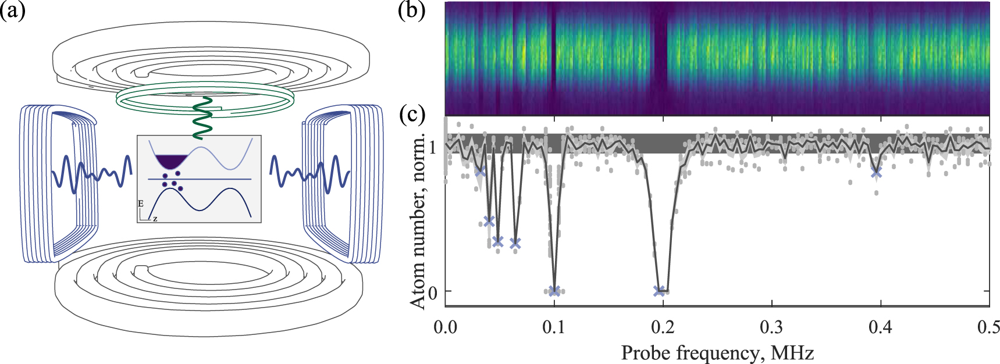

### I work on ultracold quantum matter at the University of Oxford in Chris Foot's group. 

 

## Applying machine learning optimisation methods to the production of a quantum gas (collaboration with Google DeepMind)

Now accepted for publication in Machine Learning: Science and Technology! (https://arxiv.org/abs/1908.08495)

We apply three machine learning strategies to atomic cooling processes utilized in the production of a Bose-Einstein condensate (BEC) and, for the first time, optimize both laser cooling and evaporative cooling mechanisms simultaneously. We present the results of an evolutionary optimization method (Differential Evolution), a regression method based on non-parametric inference (Gaussian Process regression) and a gradient-based function approximator (Artificial Neural Network). Online optimization is performed using no prior knowledge of the relevant experimental settings. Optimizing these cooling processes results in a factor of four increase in BEC size, as compared to intensive manual optimization and provides an automated approach that maintains close to optimal performance in long-term operation. Furthermore, we show that machine learning techniques can be used to identify the main sources of instability within the apparatus.

 

## Inelastic losses in radio-frequency dressed mixtures

Now available on the arXiv (https://arxiv.org/abs/1912.02737)

We dress atoms with multiple-radiofrequency (RF) fields and investigate the spectrum of transitions driven by an additional probe field. A complete theoretical description of this rich spectrum is presented, in which we find allowed transitions and determine their amplitudes using the resolvent formalism. Experimentally, we observe transitions up to sixth order in the probe field using RF spectroscopy of Bose–Einstein condensates trapped in single- and multiple-RF-dressed potentials. We find excellent agreement between theory and experiment, including the prediction and verification of previously unobserved transitions, even in the single-RF case.

 

## Probing multi-photon processes

Now published in New Journal of Physics (https://iopscience.iop.org/article/10.1088/1367-2630/ab2f60)

We dress atoms with multiple-radiofrequency (RF) fields and investigate the spectrum of transitions driven by an additional probe field. A complete theoretical description of this rich spectrum is presented, in which we find allowed transitions and determine their amplitudes using the resolvent formalism. Experimentally, we observe transitions up to sixth order in the probe field using RF spectroscopy of Bose–Einstein condensates trapped in single- and multiple-RF-dressed potentials. We find excellent agreement between theory and experiment, including the prediction and verification of previously unobserved transitions, even in the single-RF case.

## Teaching

Magdalen College & St Peter’s College, University of Oxford
Lecturer in Physics Tutored 1st and 2nd year mathematics, electromagnetism and statistics courses. Led development and delivery
of physics access course for students from under-represented backgrounds. Interviewed >75 prospective
undergraduates and assisted with admissions process.

Machine Learning and Quantum Technology summer lecture series. UESTC.

 
## Recent talks

2019 Invited seminar talk, Oxford University
2018 Poster presentation at Frontiers of Matter-Wave Optics, Crete, Greece
2018 Invited seminar talk, Newcastle University
2017 Poster presentation at Engineering Quantum Systems, Austria
2017 Poster presentation at Frontiers of 2D Quantum Systems, Italy

 
### Other activities

I read Natural Sciences at Pembroke College, [University of Cambridge](https://www.cam.ac.uk/), graduating with a 1st class MSci and BA in Experimental and Theoretical Physics.

See [Google Scholar](https://scholar.google.com/citations?user=Wbwb3AIAAAAJ&hl=en) for a list of publications.

See [here](CV_AJB.pdf) for a full CV.

I have represented both Oxford and Cambridge Blues in [golf](hhttp://www.cugc.uk/) and have rowed for Magdalen College 1st VIII.
